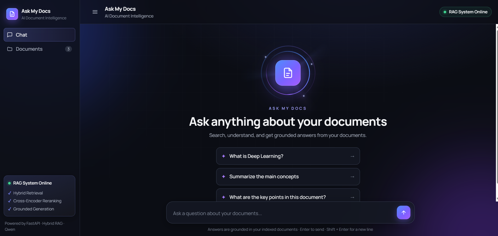

# Ask My Docs — Hybrid RAG System

Ask My Docs is a domain-specific Retrieval-Augmented Generation (RAG) system that allows users to upload documents and ask questions about their content.

The system combines keyword-based retrieval using BM25, semantic vector search, Reciprocal Rank Fusion (RRF), cross-encoder reranking, evidence sufficiency checking, grounded answer generation, and citation formatting.

The goal is to provide answers grounded in the user's uploaded documents rather than relying on unsupported external knowledge.

---

## 🚀 Demo



---

## ✨ Features

- Multi-format document ingestion
- PDF text extraction
- OCR fallback for scanned PDFs
- DOCX processing
- TXT processing
- Markdown processing
- CSV processing
- Excel processing
- PowerPoint processing
- HTML processing
- Image OCR
- Token-aware document chunking
- Semantic vector search
- BM25 keyword retrieval
- Hybrid retrieval
- Reciprocal Rank Fusion (RRF)
- Cross-encoder reranking
- Evidence sufficiency checking
- Grounded answer generation
- Source citation formatting
- Refusal when sufficient evidence is unavailable
- FastAPI backend
- Web-based frontend
- Automated RAG evaluation

---

# 🧠 How It Works

Ask My Docs follows a multi-stage RAG pipeline.

```text
                         User Question
                              │
                              ▼
                    ┌───────────────────┐
                    │  Hybrid Retrieval │
                    └─────────┬─────────┘
                              │
                    ┌─────────┴─────────┐
                    ▼                   ▼
               BM25 Search       Vector Search
                    │                   │
                    └─────────┬─────────┘
                              ▼
                    Reciprocal Rank
                       Fusion (RRF)
                              │
                              ▼
                    Cross-Encoder
                       Reranking
                              │
                              ▼
                    Evidence Sufficiency
                         Checking
                              │
                    ┌─────────┴─────────┐
                    │                   │
               Sufficient          Insufficient
                    │                   │
                    ▼                   ▼
             Grounded Prompt       Refusal
                    │
                    ▼
             Answer Generation
                    │
                    ▼
             Answer + Citations